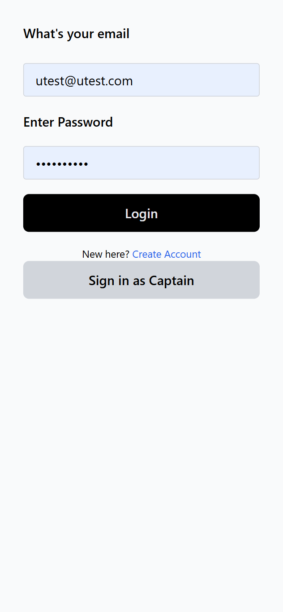
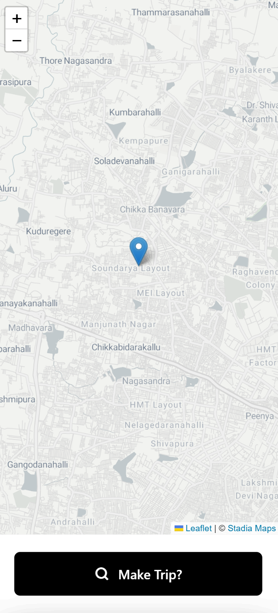
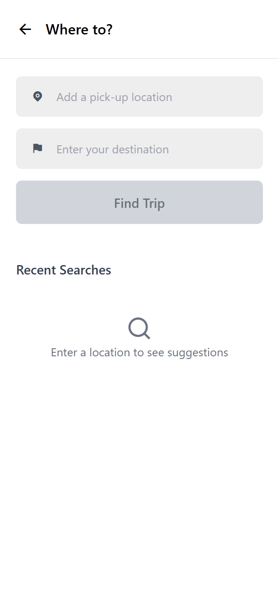
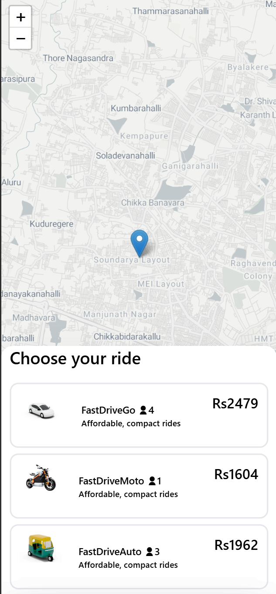
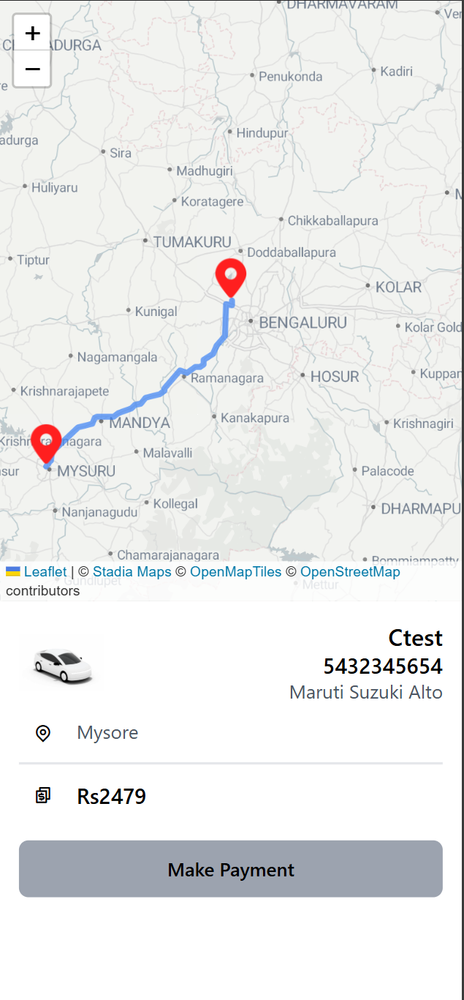
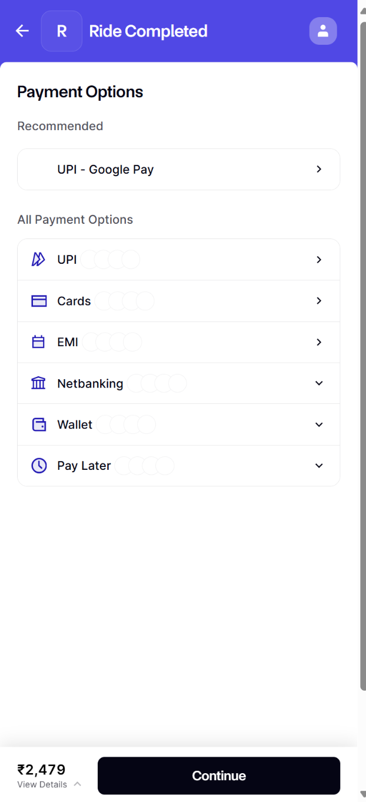
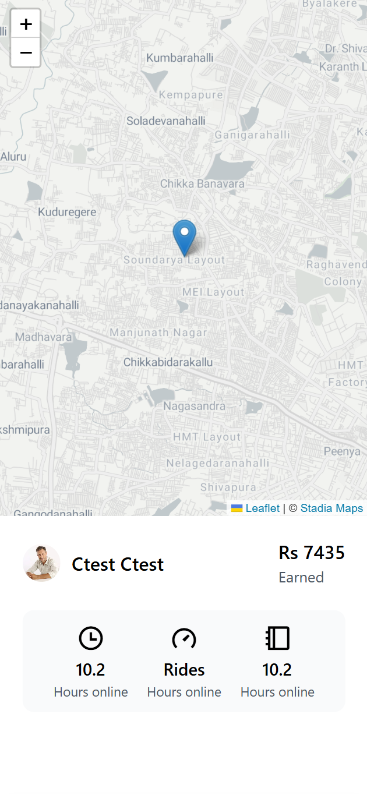
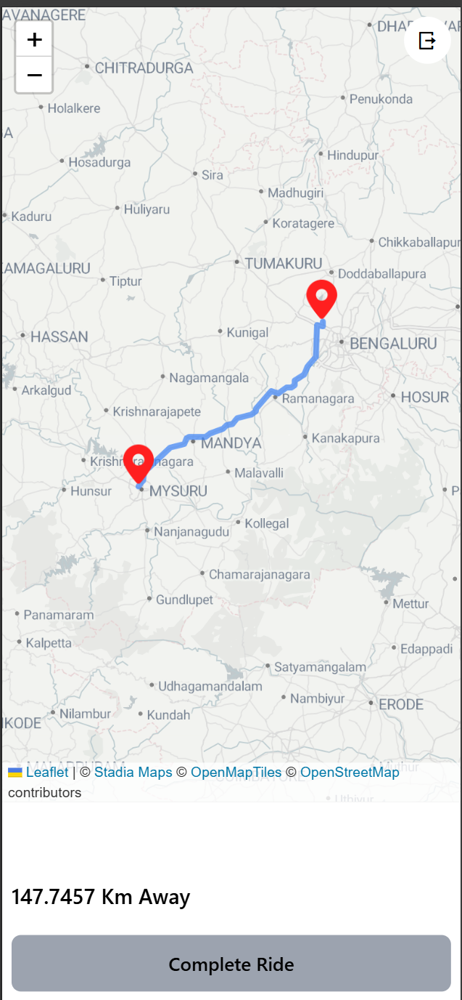

# FastDrive

## A real-time ride-hailing platform that connects passengers with drivers seamlessly. Featuring live tracking, map intigration, fare estimation, and secure payments for a superior transportation experience.

## Getting Started
  ### 🌐 Live Demo
- **Frontend**: [https://fast-drive-three.vercel.app/]
- **Backend API**: 

### 💻 Local Development
Want to run this project locally? Here's how:

#### Prerequisites
- Node.js (v18 or higher)
- MongoDB (local or Atlas)
- Git

#### Quick Setup
```bash
# 1. Clone the repository
git clone https://github.com/RajatSingh45/FastDrive
cd FastDrive

# 2. Setup backend
cd backend
npm install
cp .env.example .env
# Edit .env with your configuration
npm run dev

# 3. Setup frontend (new terminal)
cd frontend
npm install
cp .env.example .env
npm start

### Dependencies
## 🛠️ Tech Stack & Dependencies

### 📋 Overview
This is a full-stack ride-hailing application built with modern technologies and deployed on cloud infrastructure.

### 🚀 Frontend
**Framework & Core**
- **React**- UI framework
- **Javascript**
- **Vite** - Build tool and dev server
- **React Router DOM** - Client-side routing

**State Management & Data Fetching**
- **Axios** 

**UI & Styling**
- **Tailwind CSS** - Utility-first CSS framework
- **React Icons** - Icon library

**Maps & Location**
- **Leaflet Maps JavaScript API** - Maps and geolocation

**Payments & Forms**
- **Razorpay** - Payment processing

### 🔧 Backend
**Runtime & Framework**
- **Node.js** - Runtime environment
- **Express.js** - Web framework
- **JavaScript**

**Database & ODM**
- **MongoDB** - NoSQL database
- **Mongoose** - MongoDB object modeling

**Authentication & Security**
- **JWT** (jsonwebtoken) - Authentication tokens
- **bcryptjs** - Password hashing
- **cors** - Cross-origin resource sharing

**Real-time Communication**
- **Socket.io** - WebSocket communication
- **Socket.io Client** - Client-side WebSocket library

**Payments & External APIs**
- **Razorpay** - Payment processing

**Utilities & Development**
- **dotenv** - Secure environment configuration management
- **nodemon** - Development server
- **cors** - Cross-origin resource sharing configuration
- **cookie-parser** - Cookie parsing middleware for authentication

### 🛠️ Development & Build Tools
**Frontend Build**
- **Vite** - Build tool
- **Prettier** - Code formatting

**Backend Development**
- **Nodemon** - Development server restart

**Testing**
- **Postman**

### ☁️ Deployment & Infrastructure
**Hosting & Services**
- **Frontend**: Vercel
- **Backend**: Render
- **Database**: MongoDB Atlas

### Installing

#### System Requirements
- Node.js (v18.0.0 or higher)
- npm (v8.0.0 or higher)
- MongoDB (v4.4 or higher)
- Git

#### Installation Steps

1. **Clone the Repository**
```bash
git clone https://github.com/RajatSingh45/FastDrive.git
cd FastDrive
```

2. **Backend Setup**
```bash
# Navigate to backend directory
cd backend

# Install dependencies
npm install

# Create environment file
cp .env.example .env

# Configure your .env file with the following:
MONGODB_URI=your_mongodb_connection_string
JWT_SECRET=your_jwt_secret
RAZORPAY_KEY_ID=your_razorpay_key
RAZORPAY_SECRET=your_razorpay_secret
PORT=5000
```

3. **Frontend Setup**
```bash
# Navigate to frontend directory
cd frontend

# Install dependencies
npm install

# Create environment file
cp .env.example .env

# Configure your .env file with:
VITE_API_URL=http://localhost:5000
VITE_RAZORPAY_KEY_ID=your_razorpay_key
VITE_MAPS_API_KEY=your_maps_api_key
```

4. **Database Setup**
- Ensure MongoDB is running locally or you have a valid MongoDB Atlas connection string
- Update the `MONGODB_URI` in backend `.env` file

#### Verification
To verify the installation:
```bash
# Start backend server
cd backend
npm run dev

# Start frontend development server (in a new terminal)
cd frontend
npm run dev
```

The application should now be running at:
- Frontend: http://localhost:5173
- Backend: http://localhost:5000

## 📸 Screenshots

### Web UI










## 🎥 Demo Video


## License

This project is licensed under the MIT License:

See the [LICENSE.md](LICENSE.md) file for full details.

## Acknowledgments

Special thanks to the following individuals and resources that made this project possible:

### Open Source Projects
* [React](https://reactjs.org/) - Frontend framework
* [Express.js](https://expressjs.com/) - Backend framework
* [Socket.IO](https://socket.io/) - Real-time communication
* [Leaflet](https://leafletjs.com/) - Interactive maps
* [Tailwind CSS](https://tailwindcss.com/) - CSS framework

### Documentation & Templates
* [React Documentation](https://reactjs.org/docs)
* [MongoDB Documentation](https://docs.mongodb.com/)
* [Socket.IO Documentation](https://socket.io/docs/)
* [Razorpay Documentation](https://razorpay.com/docs/)

### Development Tools
* [Vercel](https://vercel.com/) - Frontend hosting
* [Render](https://render.com/) - Backend hosting
* [MongoDB Atlas](https://www.mongodb.com/atlas) - Database hosting
